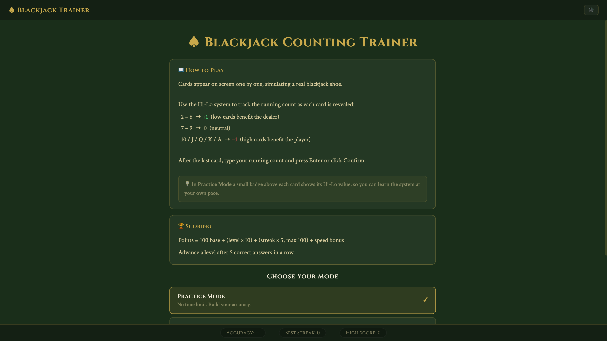
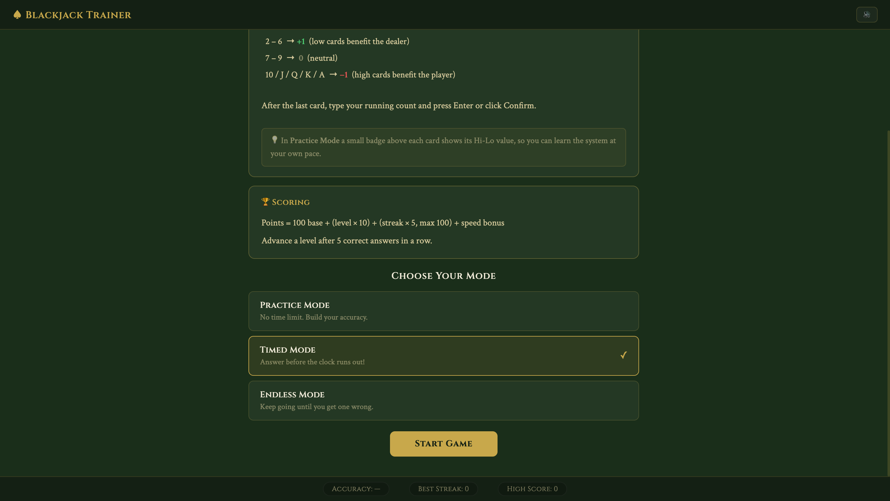
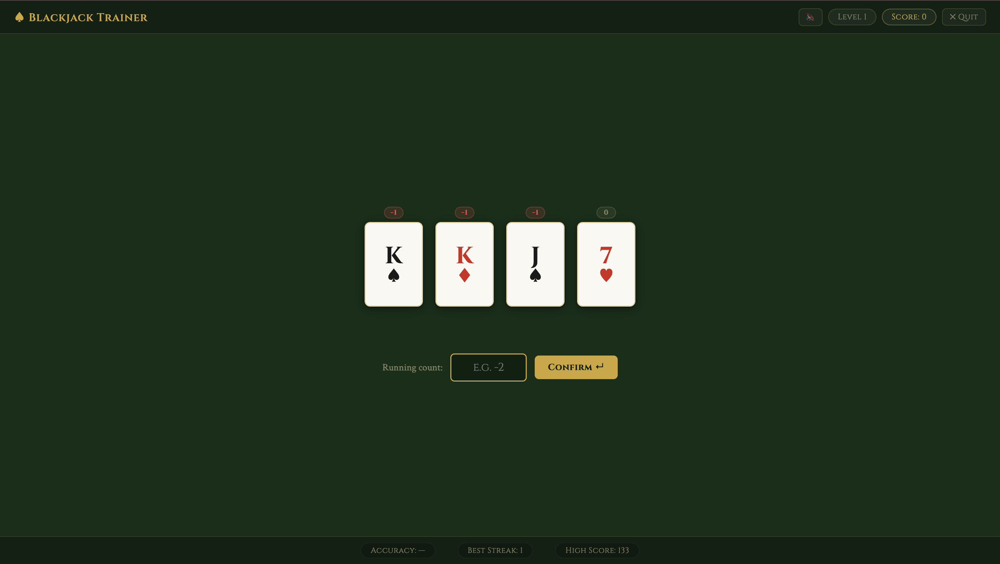

# ♠ Blackjack Card Counting Trainer

> An educational tool for mastering the **Hi-Lo card counting system** — available as a **JavaFX desktop app** and a **zero-install browser game**.

[](https://openjdk.org/)
[](https://openjfx.io/)
[](https://maven.apache.org/)
[](https://junit.org/junit5/)
[](https://blackjack-trainer-ruby.vercel.app)
[](LICENSE)

---

## 🌐 Play Now — No Install Required

**[blackjack-trainer-ruby.vercel.app](https://blackjack-trainer-ruby.vercel.app)**

The browser version is a faithful port of the Java app. Same game modes, same levels, same scoring formula, same sound effects — running in vanilla JavaScript with zero dependencies.

---

## 📸 Preview

**Home screen — rules & mode selection**





**In-game — Practice mode with Hi-Lo badges**



---

## ✨ Features

| Feature | Details |
|---|---|
| 🃏 **Hi-Lo Counting** | 2–6 → +1 · 7–9 → 0 · 10/J/Q/K/A → −1 |
| 🎮 **3 Game Modes** | Practice · Timed · Endless |
| 📈 **10 Levels** | Progressive card count, deal speed, and answer time pressure |
| ⏱ **Countdown Timer** | Timed & Endless modes: 20s → 6s across levels |
| 🏷 **Practice Badges** | Hi-Lo value shown above each card in Practice mode |
| 🏆 **Scoring System** | Base + level bonus + streak bonus + speed bonus |
| 🔊 **Sound Effects** | Background jazz music + card-deal sound on every reveal |
| 💾 **Persistent Stats** | High score, best streak, total games saved across sessions |
| 🎨 **Polished UI** | Animated card reveals, feedback colours, green-felt theme |
| 🧪 **Unit Tested** | JUnit 5 tests for all core and game logic |
| 🔌 **Extensible** | New counting systems require exactly one new class |
| 🌐 **Browser Game** | Zero-dependency JS port — plays in any modern browser |

---

## 📁 Repository Structure

```
blackjack-trainer/
├── .github/
│   └── workflows/
│       └── ci.yml              ← build Java + validate web on every push
├── src/                        ← Java desktop application
│   ├── main/
│   │   ├── java/com/blackjacktrainer/
│   │   │   ├── app/            ← Main.java · AudioManager.java
│   │   │   ├── core/           ← Card · Deck · Hand · HiLoCountSystem · GameState
│   │   │   ├── game/           ← GameController · LevelManager · ScoreManager…
│   │   │   └── ui/             ← JavaFX views and controllers
│   │   └── resources/
│   │       ├── audio/
│   │       │   ├── background.mp3
│   │       │   └── card.mp3
│   │       └── css/style.css
│   └── test/
├── web/                        ← Browser game (deployed to Vercel)
│   ├── audio/
│   │   ├── background.mp3
│   │   └── card.mp3
│   ├── css/
│   │   └── style.css
│   ├── js/
│   │   ├── core.js             ← Port of core/ package (zero DOM)
│   │   ├── audio.js            ← Port of AudioManager.java
│   │   ├── ui.js               ← DOM rendering layer
│   │   └── game.js             ← Port of GameController (event wiring)
│   └── index.html
├── vercel.json                 ← Vercel deployment config
├── pom.xml
└── README.md
```

---

## 🏗 Architecture

The project enforces a strict three-layer separation. UI never touches core directly; core never knows that JavaFX or the DOM exists.

### Java (Desktop)

```
com.blackjacktrainer
├── app/                Pure application bootstrap
│   ├── Main            JavaFX Application entry point
│   └── AudioManager    Singleton sound manager (background music + card sounds)
│
├── core/               Pure domain — zero framework dependencies
│   ├── Card            Immutable card (Rank + Suit enums)
│   ├── Deck            Shuffled 1-8 deck shoe; auto-reshuffles
│   ├── Hand            Ordered list of dealt cards
│   ├── CountSystem     Strategy interface for counting systems
│   ├── HiLoCountSystem Hi-Lo implementation
│   └── GameState       Mutable session snapshot (score, level, streak…)
│
├── game/               Orchestration — depends only on core
│   ├── GameMode        Enum: PRACTICE | TIMED | ENDLESS
│   ├── LevelConfig     Immutable config per level
│   ├── LevelManager    Progression table + advance logic
│   ├── ScoreManager    Points formula
│   ├── RoundResult     Immutable outcome of one round
│   ├── GameController  Central orchestrator
│   └── StatsPersistence Load/save to ~/.blackjack-trainer/stats.json
│
└── ui/                 JavaFX — depends on game layer only
    ├── GameView        Scene graph + layout
    ├── UIController    Bridges FX events ↔ GameController
    └── CardNode        Reusable animated card widget
```

### Web (Browser)

| File | Java equivalent | Responsibility |
|---|---|---|
| `js/core.js` | `core/` package | Pure game logic — zero DOM dependencies |
| `js/audio.js` | `AudioManager.java` | Sound management — background music + SFX |
| `js/ui.js` | `ui/` package | DOM rendering — no game logic |
| `js/game.js` | `GameController` | Event wiring + round orchestration |

---

## 🎮 Game Mechanics

### Hi-Lo System

| Cards | Value | Meaning |
|---|---|---|
| 2 · 3 · 4 · 5 · 6 | **+1** | Low cards favour the dealer |
| 7 · 8 · 9 | **0** | Neutral |
| 10 · J · Q · K · A | **−1** | High cards favour the player |

### Game Modes

| Mode | Timer | On wrong answer |
|---|---|---|
| **Practice** | None — learn at your own pace | Session continues · badges visible |
| **Timed** | ✓ Countdown per level (20s → 6s) | Session continues |
| **Endless** | ✓ Countdown per level (20s → 6s) | Session ends immediately |

### Scoring Formula

```
points = 100 + (level × 10) + min(streak × 5, 100) + max(0, 50 − responseTime × 5)
```

### Level Progression

5 consecutive correct answers advance the player by one level. There are 10 levels, each increasing card count, deal speed, and answer time pressure.

| Level | Cards | Deal delay | Answer limit |
|---|---|---|---|
| 1 | 4 | 1.8 s | 20 s |
| 2 | 5 | 1.5 s | 20 s |
| 3 | 6 | 1.3 s | 20 s |
| 4 | 6 | 1.1 s | 20 s |
| 5 | 7 | 1.0 s | 18 s |
| 6 | 7 | 0.9 s | 15 s |
| 7 | 8 | 0.8 s | 12 s |
| 8 | 8 | 0.7 s | 10 s |
| 9 | 9 | 0.6 s | 8 s |
| 10 | 10 | 0.5 s | 6 s |

---

## 🔊 Sound

| Sound | Trigger |
|---|---|
| Background jazz | Loops from session start; fades in/out smoothly |
| Card deal | Plays on every card reveal |
| Correct chime | Plays on correct answer |
| Wrong buzz | Plays on wrong answer or timer expiry |

The 🔊 button in the navbar mutes/unmutes all audio. The preference is persisted across sessions.

Audio files live in:
- **Web:** `web/audio/background.mp3`, `web/audio/card.mp3`
- **Java:** `src/main/resources/audio/background.mp3`, `src/main/resources/audio/card.mp3`

---

## 🛠 Tech Stack

| Technology | Version | Used for |
|---|---|---|
| Java | 21 | Desktop app — records, switch expressions, pattern matching |
| JavaFX | 21 | Desktop UI — Timeline, FadeTransition, MediaPlayer |
| Maven | 3.9 | Build, test, fat-JAR packaging |
| JUnit 5 | 5.x | Unit tests for core/ and game/ layers |
| Vanilla JS | ES2020 | Browser game — zero dependencies |
| Web Audio API | — | Synthesised correct/wrong tones in the browser |
| Vercel | — | Static hosting for the web version |
| GitHub Actions | — | CI — runs Java tests + web validation on every push |

---

## 🚀 Getting Started

### Play in the browser (no install)

Open **[blackjack-trainer-ruby.vercel.app](https://blackjack-trainer-ruby.vercel.app)** — that's it.

### Run the desktop app

Prerequisites: JDK 21+, Maven 3.9+ (JavaFX pulled automatically by Maven).

```bash
git clone https://github.com/Nokz22/blackjack-trainer.git
cd blackjack-trainer
mvn javafx:run
```

### Run the tests

```bash
mvn test
```

### Build a fat JAR

```bash
mvn package
java -jar target/blackjack-trainer-1.0.0.jar
```

---

## 🔌 Adding a New Counting System

The `CountSystem` interface (Strategy pattern) means adding a new system requires exactly one new class:

```java
// Java
public class KnockoutCountSystem implements CountSystem {
    @Override
    public int valueFor(Card card) {
        return switch (card.getRank()) {
            case TWO, THREE, FOUR, FIVE, SIX, SEVEN -> +1;
            case EIGHT, NINE                         ->  0;
            case TEN, JACK, QUEEN, KING, ACE         -> -1;
        };
    }

    @Override
    public String getName() { return "KO (Knockout)"; }
}
```

The JavaScript equivalent in `web/js/core.js` follows the same pattern — add a new value function and register it in the mode selector.

---

## 📱 Mobile Migration Guide

The entire `core/` and `game/` packages are **pure Java with zero framework dependencies** and can be copied directly to an Android or Kotlin Multiplatform project.

```
core/     ✅ Copy directly to Android / KMP
game/     ✅ Copy directly to Android / KMP
ui/       ❌ JavaFX — rewrite with Jetpack Compose
```

### Suggested Android ViewModel

```kotlin
class GameViewModel : ViewModel() {
    private val controller = GameController(GameMode.PRACTICE, HiLoCountSystem())

    fun startRound() = controller.startRound()

    fun submitAnswer(count: Int, elapsed: Double) =
        controller.submitAnswer(count, elapsed)
}
```

---

## 🗺 Roadmap

- [x] Hi-Lo card counting system
- [x] 3 game modes (Practice · Timed · Endless)
- [x] 10 progressive difficulty levels
- [x] Countdown timer in Timed and Endless modes
- [x] Hi-Lo value badges in Practice mode
- [x] Background music + card sound effects
- [x] Browser version deployed on Vercel
- [ ] Hi-Opt I and KO counting system support
- [ ] True Count (running ÷ remaining decks) toggle
- [ ] Settings screen (number of decks, counting system)
- [ ] Full keyboard navigation
- [ ] Export stats to CSV
- [ ] Animated level-up celebration screen

---

## 🤝 Contributing

Pull requests are welcome. Please:

- Follow the existing package structure in both Java and web layers.
- Add JUnit 5 tests for any new `core/` or `game/` logic.
- Keep UI code out of `core/` — the layer separation is intentional.
- Mirror logic changes in both Java (`src/`) and JavaScript (`web/js/core.js`) simultaneously.

---

## 📄 License

MIT © 2026 Nokz22

---

*Made with ♠ ♥ ♦ ♣*
